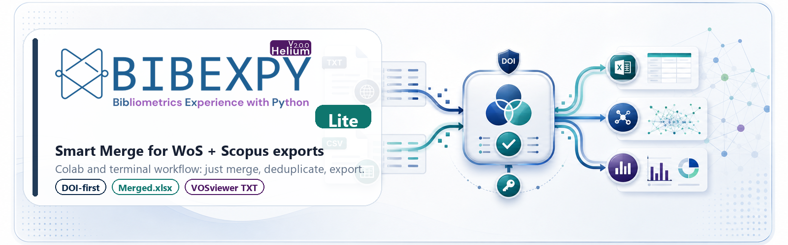

<p align="center">
  <a href="https://colab.research.google.com/github/bcankara/BibexPy-Lite/blob/main/BibexPy_Lite.ipynb">
    
  </a>
</p>

<p align="center">
  <a href="https://colab.research.google.com/github/bcankara/BibexPy-Lite/blob/main/BibexPy_Lite.ipynb">
    
  </a>
</p>

<p align="center">
  <a href="https://www.gnu.org/licenses/gpl-3.0"></a>
  <a href="https://doi.org/10.1016/j.softx.2025.102098"></a>
  <a href="https://github.com/bcankara/BibexPy"></a>
</p>

<p align="center">
  <strong>▶ Merge Web of Science + Scopus in Google Colab — nothing to install.</strong><br>
  <a href="https://colab.research.google.com/github/bcankara/BibexPy-Lite/blob/main/BibexPy_Lite.ipynb"><b>Open the notebook</b></a> → run cell 1 → run cell 2 → pick your project.
</p>

A **lightweight, terminal / Colab** tool that merges **Web of Science + Scopus**
exports into a single deduplicated dataset using BibexPy's **Smart Merge**
algorithm (DOI-determinative deduplication).

It is the "just merge" companion to the full [BibexPy](https://github.com/bcankara/BibexPy)
app: same merge algorithm, no web UI, no API/ML enrichment — ideal for a quick
run in Google Colab or a terminal, the way BibexPy v1 worked.

> **What it does:** read raw WoS `.txt` + Scopus `.csv` → merge & deduplicate →
> write `Merged.xlsx` and a VOSviewer / biblioshiny-ready `Merged_Vos.txt`.
> **What it does NOT do:** enrichment, APIs, filtering, harmonization, reporting.
> For those, use the full BibexPy app.

---

## Smart Merge in one line

Records are matched in stages: **negative rules → DOI exact → PMID exact →
Title+Year+Surname → Journal+Volume+Pages → borderline**. **DOI is
determinative** — two records whose normalized DOIs differ are *never* the same
publication (no auto-merge, no false dedup). Field values are combined with
fixed per-field source preferences (e.g. abstract/authors from Scopus, citations
from Web of Science).

Uncertain pairs (title similarity 0.80–0.92) are **kept separate** and written
to `Borderline_Uncertain.xlsx` for you to review manually.

---

## ▶ Run in Google Colab (recommended — no install)

[](https://colab.research.google.com/github/bcankara/BibexPy-Lite/blob/main/BibexPy_Lite.ipynb)

1. Click the badge → the notebook opens in Colab.
2. Run **cell 1** (setup) and **cell 2** (merge) — pick your project from the menu.
3. Try the bundled **Sample Project**, or upload your own WoS `.txt` + Scopus `.csv`
   with the optional cell, then run cell 2.

Results are saved under `Workspace/<project>/Analysis_<timestamp>/`.

## Use in a terminal

```bash
git clone https://github.com/bcankara/BibexPy-Lite.git
cd BibexPy-Lite
pip install -r requirements.txt
python merge.py
```

### Project layout

Put your raw exports under `Workspace/<Your Project>/Data/`:

```
Workspace/
  My Project/
    Data/
      savedrecs.txt      # Web of Science plain-text export(s) — one or more
      scopus.csv         # Scopus CSV export(s) — one or more
```

Run `python merge.py`, pick your project from the numbered menu, and the
results are written to `Workspace/My Project/Analysis_<timestamp>/`:

| File | Description |
|------|-------------|
| `Merged.xlsx` | Final deduplicated dataset |
| `Merged_Vos.txt` | WoS-tagged text for VOSviewer / biblioshiny |
| `Borderline_Uncertain.xlsx` | Uncertain pairs kept separate (review) |
| `Conflict_Log.xlsx` | Field conflicts resolved during merge |
| `Lost_WoS.xlsx` / `Lost_Scopus.xlsx` | Records with no match |
| `Statistics.xlsx` | Summary counts |

## Use as a library

```python
from bibexpy_lite import read_wos, read_scopus, smart_merge

wos = read_wos("Workspace/My Project/Data/savedrecs.txt")
scp = read_scopus("Workspace/My Project/Data/scopus.csv")
res = smart_merge(wos, scp)

res.merged.to_excel("merged.xlsx", index=False)
print(res.stats)            # counts: duplicates_removed, merged_count, ...
print(res.borderline)       # uncertain pairs
```

---

## Relationship to the main BibexPy

The Smart Merge algorithm here (`bibexpy_lite/smart_merge.py`) is a **vendored
copy** of the canonical implementation in
[BibexPy](https://github.com/bcankara/BibexPy) (`apps/api/services/smart_merger.py`).
The algorithm is the single source of truth there; this repo keeps a copy so it
can run with no web dependencies. They are kept in sync and produce identical
merge results.

## Citation

BibexPy-Lite uses the BibexPy Smart Merge algorithm. If you use it in your research, please cite:

> Kara, B. C., Şahin, A., & Dirsehan, T. (2025). BibexPy: Harmonizing the bibliometric
> symphony of Scopus and Web of Science. *SoftwareX*, 30, 102098.
> https://doi.org/10.1016/j.softx.2025.102098

```bibtex
@article{bibexpy2025,
  title   = {BibexPy: Harmonizing the bibliometric symphony of {Scopus} and {Web of Science}},
  author  = {Kara, Burak Can and {\c{S}}ahin, Alperen and Dirsehan, Ta{\c{s}}k{\i}n},
  journal = {SoftwareX},
  volume  = {30},
  pages   = {102098},
  year    = {2025},
  doi     = {10.1016/j.softx.2025.102098}
}
```

## License

GPL-3.0-or-later. See [LICENSE](LICENSE).
